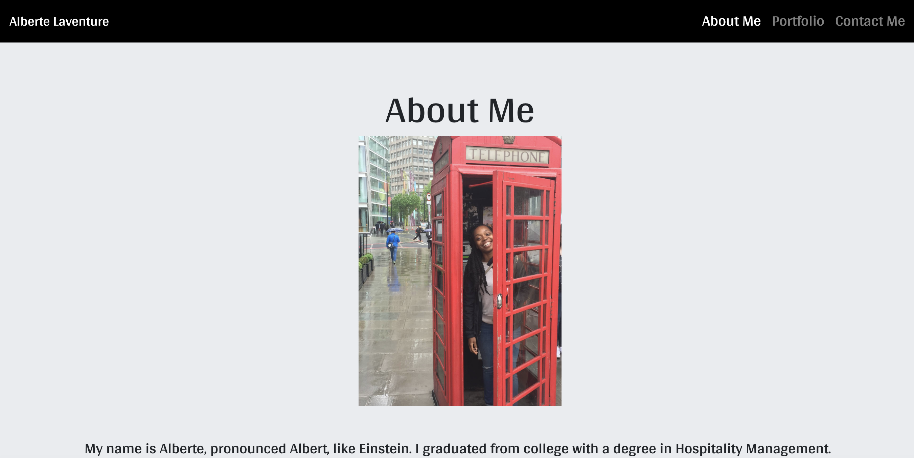
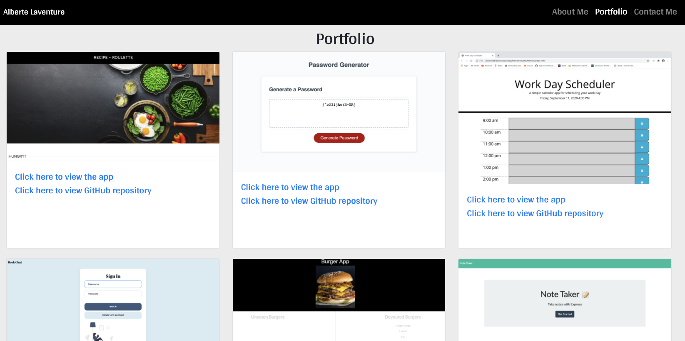
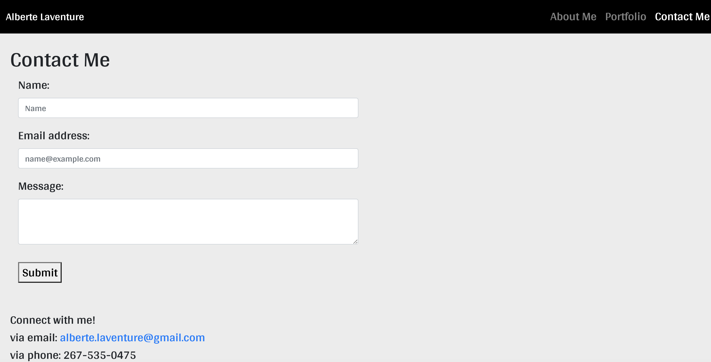

# My Portfolio

In my Portfolio, you will learn a bit more about me and my future goals. My responsive portfolio features 3 tabs: About Me, Portfolio, and Contact Me. My Portfolio currently houses 6 projects/homework assignments that I worked on this year. The Contact Me page also features a link to my Linkedin profile, Github, email address & phone number for easy connecting. I look forward to updating this Portfolio as I continue through my coding journey.

Deployed Link: https://albie140.github.io/

## Technologies Used
HTML, CSS

## Questions?
Email: alberte.laventure@gmail.com

## License

